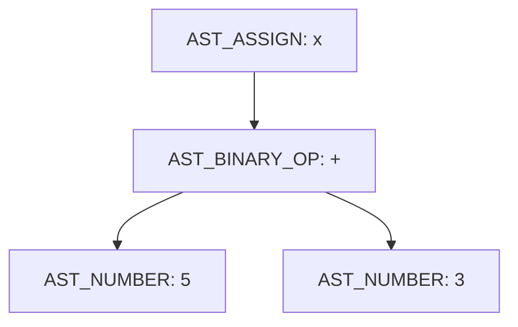

# Relatório — Análise do Mini C Compiler

## 1. Identificação do estudante

- **Nome:** Renato
- **Curso:** Ciência da Computação — IDP
- **Disciplina:** Compiladores

## 2. Identificação do projeto original

- **Repositório analisado:** [ironrinox/mini-c-compiler](https://github.com/ironrinox/mini-c-compiler)
- **Licença:** MIT
- **Descrição:** um interpretador escrito em C para uma linguagem experimental bem pequena, com o objetivo de ensinar as fases clássicas de um compilador (léxico, sintático e execução).

Todo o crédito pela implementação original é do autor `ironrinox`. Este repositório mantém a licença MIT do projeto e documenta, neste relatório, as análises e a modificação individual que eu implementei.

## 3. Objetivo da atividade

O objetivo não foi só rodar o projeto, mas acompanhar o caminho completo de um programa-fonte até o resultado: da leitura do arquivo, passando pela análise léxica, pela construção da AST, até a interpretação. Também era preciso identificar limitações reais do projeto e implementar uma pequena melhoria individual.

## 4. Preparação do ambiente

Usei Git para clonar o repositório e GCC para compilar. Conferi as versões antes de começar:

```
git --version
gcc --version
```

Cloneiem o projeto original com:

```
git clone https://github.com/ironrinox/mini-c-compiler.git
cd mini-c-compiler
```

## 5. Procedimento de compilação e execução

A compilação segue exatamente o que está no README do projeto, listando todos os arquivos `.c` manualmente (o projeto não usa Makefile):

```
gcc src/main.c src/lexer.c src/parser.c src/interpreter.c src/utils.c -Iinclude -o mini-c
```

E a execução recebe o caminho do arquivo-fonte como argumento:

```
./mini-c examples/test.txt
```

Compilei sem nenhum warning e a execução do exemplo original (`let x = 5 + 3; let y = 1 + 1; print(x + y);`) devolveu `10`, como esperado.

## 6. Arquitetura e responsabilidades dos arquivos

| Arquivo | Responsabilidade principal | Principais funções |
| --- | --- | --- |
| `src/main.c` | Coordena todo o pipeline: lê, tokeniza, faz o parse e interpreta | `main` |
| `src/utils.c` | Lê o conteúdo do arquivo-fonte para a memória | `read_file` |
| `include/lexer.h` | Define os tipos de token e as estruturas `Token`/`TokenList` | — |
| `src/lexer.c` | Transforma a string do código-fonte em uma lista de tokens | `lex`, `create_token`, `print_tokens` |
| `include/parser.h` | Define os tipos de nó da AST e a estrutura `ASTNode` | — |
| `src/parser.c` | Constrói a AST a partir dos tokens e sabe imprimi-la | `parse`, `parse_statement`, `parse_expression`, `create_node`, `print_ast` |
| `include/interpreter.h` | Define a tabela de símbolos e os protótipos do interpretador | — |
| `src/interpreter.c` | Percorre a AST, mantém a tabela de símbolos e executa o programa | `init_symbol_table`, `lookup_symbol`, `set_symbol`, `eval_expression`, `exec_statement`, `interpret` |
| `examples/test.txt` | Programa de exemplo usado no README | — |

## 7. Análise do ponto de entrada (`main.c`)

A função `main` recebe o caminho do arquivo pelo `argv[1]`. Se `argc < 2` (ou seja, ninguém passou um argumento), o programa imprime uma mensagem de erro em `stderr` explicando o uso correto e encerra com `EXIT_FAILURE`, sem nem tentar ler nada.

Trecho relevante:

```c
char* source_code = read_file(argv[1]);
TokenList tokens = lex(source_code);
ASTNode* ast = parse(&tokens);
interpret(ast);
```

A ordem de chamadas é sempre a mesma: `read_file` → `lex` → `parse` → `interpret`. Cada etapa depende do resultado da anterior — o parser só existe porque recebe uma lista de tokens pronta, e o interpretador só existe porque recebe uma AST pronta. É o pipeline clássico de compiladores/interpretadores.

## 8. Análise da leitura do arquivo (`utils.c`)

A função `read_file` abre o arquivo em modo texto, descobre o tamanho com `fseek`/`ftell`, aloca um buffer desse tamanho +1 byte com `malloc`, lê tudo de uma vez com `fread` e adiciona um `'\0'` no final.

- **Por que reservar memória?** Porque o tamanho do arquivo só é conhecido em tempo de execução — não dá para usar um array de tamanho fixo sem arriscar não caber o conteúdo (ou desperdiçar memória).
- **Papel do `\0`:** em C, strings não têm um campo de "tamanho" embutido; o final é marcado pelo caractere nulo. Sem ele, funções como `strcmp` ou `strlen` (usadas no lexer) leriam memória além do conteúdo real do arquivo.
- **Arquivo inexistente:** `fopen` retorna `NULL`, o `if (!file)` captura isso, chama `perror` (que imprime a mensagem de erro do sistema) e encerra com `exit(EXIT_FAILURE)`.
- **Quem libera a memória:** `main.c` faz o `free(source_code)` no final, depois que já não precisa mais do texto original.

## 9. Análise léxica (`lexer.c`)

O `enum TokenType` em `lexer.h` define os tokens: `T_NUMBER`, `T_PLUS`, `T_MINUS`, `T_MULT`, `T_DIV`, `T_LET`, `T_IDENTIFIER`, `T_EQUAL`, `T_PRINT`, `T_SEMICOLON`, `T_LPAREN`, `T_RPAREN`, `T_EOF`.

A função `lex` percorre a string caractere a caractere:

- espaços são pulados com `isspace`;
- sequências de dígitos (`isdigit`) viram `T_NUMBER`, construindo o valor inteiro dígito a dígito (`value = value * 10 + digito`);
- sequências de letras/dígitos (`isalpha` seguido de `isalnum`) formam um identificador; se o texto for exatamente `let` ou `print`, vira palavra reservada, senão vira `T_IDENTIFIER`;
- operadores e pontuação são tratados em um `switch`;
- um caractere não reconhecido imprime `"Unknown character"` e encerra o programa com `exit(1)` — não há recuperação de erro léxico;
- ao final, um token `T_EOF` é sempre adicionado.

### 9.1 Teste léxico válido

Comando: `./mini-c testes/01_lexico_valido.txt` com o conteúdo:
```
let valor1 = 123 + 4;
print(valor1);
```
Tokens gerados: `LET IDENT(valor1) EQUAL NUMBER(123) PLUS NUMBER(4) SEMICOLON PRINT IDENT(valor1) SEMICOLON EOF`. Saída do programa: `127`.

### 9.2 Teste léxico inválido

Comando: `./mini-c testes/02_lexico_invalido.txt` com `let valor = 10 @ 2;`.

- **Mensagem produzida:** `Unknown character: @`
- **Caractere causador:** `@`
- **Arquivo/função responsáveis:** `src/lexer.c`, função `lex` (bloco `default` do `switch`)
- **Classificação:** erro léxico — o caractere nem chega a formar um token válido.

### 9.3 Respostas às perguntas obrigatórias

1. O lexer usa `strcmp` no texto lido: se for exatamente `"let"`, gera `T_LET`; senão, se for outra palavra, vira `T_IDENTIFIER`.
2. Um número com vários dígitos é construído em um laço que multiplica o valor acumulado por 10 e soma o novo dígito, até encontrar um caractere que não seja dígito.
3. Sim — identificadores como `nota1` são aceitos, pois depois da primeira letra o lexer aceita `isalnum` (letras e números).
4. Não — um identificador não pode começar com número, porque o primeiro `if` que entra nesse bloco exige `isalpha(c)`. Um identificador começando com dígito seria lido primeiro como `T_NUMBER` e o restante geraria um erro léxico ou um identificador separado.
5. Não. O `Token` só guarda `type`, `value` e `name` — não existe campo de linha/coluna, então mensagens de erro não indicam onde no arquivo o problema ocorreu.
6. Sim — o array de tokens é alocado com `malloc(128 * sizeof(Token))` e não é redimensionado em nenhum ponto do código.
7. Se o programa gerar mais de 128 tokens, `lex` vai escrever fora dos limites do array alocado (buffer overflow), o que é comportamento indefinido em C — pode travar, corromper dados ou (com sorte) não dar erro nenhum imediatamente.

## 10. Análise sintática (`parser.c`)

O parser trabalha com duas funções principais: `parse_statement` (reconhece `let ... ;` e `print ( ... ) ;`) e `parse_expression` (reconhece números, identificadores, parênteses e operadores binários). `create_node` centraliza a criação de nós da AST.

### 10.1 Testes sintáticos obrigatórios

| Teste | Entrada | Resultado observado | Mensagem | Posição | Função responsável |
| --- | --- | --- | --- | --- | --- |
| `03_sintatico_valido.txt` | `let resultado = (10 + 5) * 2; print(resultado);` | Executa e imprime `30` | — | — | `parse_statement` / `parse_expression` |
| `04_sem_igual.txt` | `let resultado 10 + 5;` | Erro, código de saída 1 | `Syntax error: expected '=' at pos=2` | pos=2 | `parse_statement` |
| `05_sem_ponto_virgula.txt` | `let resultado = 10 + 5` | Erro, código de saída 1 | `Syntax error: expected ';' at pos=6` | pos=6 | `parse_statement` |
| `06_parentese_incompleto.txt` | `print((10 + 5);` | Erro, código de saída 1 | `Syntax error: expected ')' at pos=7` | pos=7 | `parse_expression` |

Em todos os casos de erro sintático, o programa chama `exit(1)` imediatamente — não há tentativa de recuperação nem relatório de múltiplos erros de uma vez.

## 11. Análise da AST

A AST usa cinco tipos de nó (`AST_NUMBER`, `AST_BINARY_OP`, `AST_VAR`, `AST_ASSIGN`, `AST_PRINT`) e uma estrutura só (`ASTNode`) com dois ponteiros filhos (`left`, `right`), reaproveitados com significados diferentes dependendo do tipo de nó.

Para `let x = 5 + 3; print(x);`, a AST impressa por `print_ast` foi:

```
AST_ASSIGN(x)
  AST_BINARY_OP(+)
    AST_NUMBER(5)
    AST_NUMBER(3)
```



- O nó `AST_ASSIGN` representa a atribuição.
- O nome `x` fica armazenado no campo `name` do próprio nó `AST_ASSIGN`.
- Os números 5 e 3 são representados por dois nós `AST_NUMBER` (folhas da árvore).
- A soma é representada por um nó `AST_BINARY_OP`, com o caractere `'+'` guardado no campo `value`.
- `left` guarda a subexpressão à esquerda do operador, `right` guarda a subexpressão à direita. Em nós que não são binários (como `AST_ASSIGN` e `AST_PRINT`), só `left` é usado para a subexpressão — `right` fica livre para outro propósito (ver seção 18).

**Observação importante:** rodando o teste, notei que `print_ast` só mostra a árvore da *primeira* instrução do programa. Isso acontece porque `print_ast` percorre `left`/`right` como filhos de expressão, mas a lista de instruções do programa também é encadeada pelo campo `right` do nó raiz de cada statement (ver seção 18) — e `print_ast` não sabe percorrer essa lista. Ou seja, o `print(x)` da segunda instrução nunca aparece na impressão da AST, mesmo sendo executado corretamente pelo interpretador.

## 12. Análise da tabela de símbolos e do interpretador

A tabela de símbolos (`SymbolTable`) é um array fixo de 128 `Symbol` (nome + valor). `set_symbol` procura o nome; se já existe, atualiza o valor; se não existe, adiciona uma nova entrada (ou reporta overflow se `count == 128`). `lookup_symbol` faz uma busca linear e, se não encontrar, imprime `"Runtime error: undefined variable"` e encerra.

`interpret` cria a tabela, percorre a lista de statements (via `current->right`) e chama `exec_statement` para cada um. `exec_statement` decide entre atribuição (`AST_ASSIGN`), impressão (`AST_PRINT`) ou uma expressão solta. `eval_expression` calcula recursivamente números, variáveis e operações binárias, com proteção específica contra divisão por zero.

### 12.1 Testes obrigatórios

| Teste | Entrada | Saída | Classificação |
| --- | --- | --- | --- |
| `07_var_definida.txt` | `let idade = 30; print(idade);` | `30` | Execução correta |
| `08_var_nao_definida.txt` | `print(idade);` | `Runtime error: undefined variable 'idade'` | Erro semântico detectado durante a execução |
| `09_divisao_por_zero.txt` | `let resultado = 10 / 0; print(resultado);` | `Runtime error: division by zero` | Outro erro de execução (verificação aritmética) |

**Por que a variável indefinida só é detectada pelo interpretador, e não pelo parser?** Porque o parser só valida a *forma* do programa (se tem `=`, `;`, parênteses corretos), sem nenhuma noção de quais variáveis existem — essa é uma responsabilidade semântica, e o projeto não tem uma fase de análise semântica separada. A checagem só acontece no momento em que `lookup_symbol` tenta buscar o nome na tabela, durante a interpretação.

## 13. Classificação do projeto: compilador, interpretador ou transpiler?

O projeto é um **interpretador**. Ele não produz nenhum arquivo de saída, não gera assembly, não gera bytecode e não gera código em outra linguagem (o que descartaria "transpiler"). Em vez disso, `interpret` percorre a AST construída por `parse` e calcula os resultados diretamente em `eval_expression`/`exec_statement`, imprimindo o resultado com `printf` na hora. Um compilador de verdade produziria uma saída (executável, assembly ou bytecode) que poderia ser executada depois, separadamente — isso não acontece aqui, mesmo o repositório se chamando "Mini C Compiler".

## 14. Resultados dos testes (tabela consolidada)

| ID | Entrada | Resultado esperado | Resultado obtido | Situação |
| --- | --- | --- | --- | --- |
| T01 | `examples/test.txt` (programa original) | `10` | `10` | Aprovado |
| T02 | `let valor = 10 @ 2;` | Erro léxico | `Unknown character: @` | Aprovado |
| T03 | `let resultado 10 + 5;` | Erro sintático (falta `=`) | `Syntax error: expected '=' at pos=2` | Aprovado |
| T04 | `let resultado = 10 + 5` | Erro sintático (falta `;`) | `Syntax error: expected ';' at pos=6` | Aprovado |
| T05 | `print((10 + 5);` | Erro sintático (parêntese incompleto) | `Syntax error: expected ')' at pos=7` | Aprovado |
| T06 | `print(idade);` | Erro de variável não definida | `Runtime error: undefined variable 'idade'` | Aprovado |
| T07 | `let resultado = 10 / 0; print(resultado);` | Erro de divisão por zero | `Runtime error: division by zero` | Aprovado |
| T08 | `print(2 * 3 + 4);` | `10` (convenção matemática) | `14` | **Reprovado — bug de precedência (ver seção 15)** |
| T09 | `print(10 - 3 - 2);` | `5` (associatividade à esquerda) | `9` | **Reprovado — bug de associatividade (ver seção 15)** |
| T10 | Comentários de uma linha (`//`) — minha extensão | Comentário ignorado pelo lexer | Ignorado corretamente, sem gerar token | Aprovado |

## 15. Análise de precedência e associatividade

Esta foi a parte mais reveladora da análise. O parser atual **não implementa nenhuma hierarquia de precedência** entre `+`, `-`, `*` e `/`, e sua recursão o torna **associativo à direita** para todos os operadores.

Isso acontece porque, em `parse_expression`, quando um operador binário é encontrado, o lado direito é obtido chamando `parse_expression` novamente (a função inteira), em vez de chamar uma função de nível de precedência mais alta (como seria `parse_term` em um parser com precedência correta). Isso faz o lado direito "engolir" qualquer operador seguinte, formando uma árvore que cresce para a direita.

- **Teste A:** `2 * 3 + 4` → esperado `10`, obtido **`14`**. A AST mostra que o `*` é o nó raiz, com `2` à esquerda e `(3 + 4)` à direita — ou seja, o programa calculou `2 * (3 + 4)`, não `(2 * 3) + 4`. Isso prova que não existe precedência entre `*` e `+`.
- **Teste B:** `10 - 3 - 2` → esperado `5` (associatividade à esquerda: `(10-3)-2`), obtido **`9`**. A AST mostra `10 - (3 - 2)`, ou seja, associatividade à direita, que é matematicamente incorreta para subtração.
- **Teste C:** `2 + 3 * 4` → esperado `14`, obtido **`14`**. Aqui o resultado bate com a convenção matemática, mas por coincidência: como a árvore cresce à direita, `3 * 4` acaba sendo calculado primeiro de qualquer forma, e nesse caso específico isso coincide com a precedência correta. Não é porque o parser "acertou" a precedência — é só o resultado combinar com a estrutura recursiva à direita.

**Conclusão:** existe sim um problema real de precedência e de associatividade no parser atual. O projeto resolve corretamente apenas quando o agrupamento à direita coincide, por acaso, com o resultado matematicamente esperado.

## 16. Melhoria individual implementada: comentários de uma linha (`//`)

- **Problema/limitação escolhida:** o lexer original não reconhece nenhuma forma de comentário; qualquer `//` no código-fonte seria interpretado como dois tokens `T_DIV` seguidos, ou geraria comportamento inesperado no parser.
- **Comportamento anterior:** um trecho como `// comentário` gerava dois tokens `DIV` e depois tentava tokenizar "comentário" como identificador, sem nenhum tratamento especial.
- **Comportamento desejado:** ao encontrar `//`, o lexer deve ignorar tudo até o fim da linha (ou fim do arquivo), sem gerar nenhum token para esse trecho — igual ao comportamento de comentários de linha em C.
- **Arquivo alterado:** `src/lexer.c`.
- **Função alterada:** `lex` (adicionado um novo bloco de verificação, logo após o tratamento de espaços em branco).
- **Decisão de implementação:** verifiquei `c == '/' && source[i+1] == '/'` antes de cair no `switch` de operadores — assim um único `/` continua sendo reconhecido normalmente como `T_DIV` (usado na divisão), e só a sequência dupla `//` é tratada como início de comentário. Ao detectar o comentário, avanço o índice `i` até encontrar `\n` ou o fim da string, sem criar nenhum token.
- **Casos de teste:** `testes/13_comentarios.txt`, com comentários em linha própria e comentários no final da linha, misturados com uma divisão normal (`/`) para garantir que os dois casos não se confundem.
- **Resultado obtido:** o programa ignorou corretamente todos os comentários e produziu a saída esperada (`8` e `5`); o teste de controle com `20 / 4` continuou funcionando e produzindo `5`, confirmando que `/` e `//` são tratados de forma distinta.
- **Limitações que permaneceram:** não implementei comentários de bloco (`/* ... */`); e um comentário exatamente no último caractere do arquivo, sem quebra de linha, funciona porque o laço também para em `\0`, mas isso não foi testado de forma exaustiva com arquivos de encoding diferente de ASCII/UTF-8 simples.

## 17. Limitações gerais encontradas no projeto

Além do bug de precedência/associatividade (seção 15) e da limitação de `print_ast` (seção 11), destaco:

- **Lista de tokens de tamanho fixo:** `malloc(128 * sizeof(Token))` sem nenhuma verificação de limite nem redimensionamento — um programa com mais de 128 tokens causa escrita fora dos limites do array.
- **Tabela de símbolos de tamanho fixo:** 128 variáveis no máximo, com checagem de overflow (ao menos essa tem verificação e mensagem de erro).
- **Ausência de rastreamento de linha/coluna:** todas as mensagens de erro (léxicas, sintáticas e de execução) não indicam onde no código-fonte o problema ocorreu, dificultando a depuração em programas maiores.
- **Ausência de liberação da AST:** a memória alocada por `create_node` nunca é liberada com `free` — para um interpretador que roda uma vez e termina isso não é grave, mas seria um vazamento de memória em um uso mais intensivo.
- **Reuso ambíguo do campo `right`:** ele serve tanto como "próximo statement" (na lista encadeada de instruções) quanto como "operando direito" (em `AST_BINARY_OP`). Isso funciona no código atual porque não existem statements que sejam expressões binárias soltas seguidas de outro statement, mas é uma armadilha para quem for estender a linguagem sem entender essa dualidade.

## 18. Conclusão

Analisar o `mini-c-compiler` deixou claro o quanto cada fase de um interpretador depende da anterior: o lexer só funciona porque recebe uma string bem formada de `read_file`; o parser só funciona porque recebe uma lista de tokens; o interpretador só funciona porque recebe uma AST válida. Apesar do nome do projeto, ele é hoje um interpretador — não gera nenhum artefato de saída, apenas calcula e imprime o resultado diretamente a partir da árvore sintática.

A parte mais importante da análise foi não presumir que o código estava correto: os testes de precedência e associatividade (Etapa 8) revelaram um bug real no parser, escondido pelo fato de o projeto só ter sido testado originalmente com expressões simples de dois termos. Implementar e testar comentários de uma linha, por outro lado, foi uma mudança pequena e isolada, mas que exigiu entender exatamente onde no fluxo do lexer era seguro interceptar o caractere `/` sem quebrar a divisão já existente.

## 19. Referências

IRONRINOX. **Mini C Compiler**. GitHub. Disponível em: <https://github.com/ironrinox/mini-c-compiler>. Acesso em: 18 ago. 2026.
